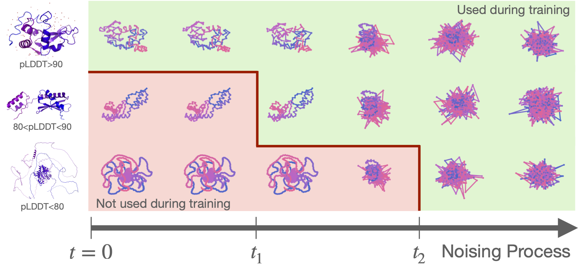

# Ambient Protein Diffusion

By [Giannis Daras*](mailto:gdaras@mit.edu), [Jeffrey Ouyang-Zhang*](mailto:jozhang@utexas.edu), [Krithika Ravishankar](mailto:krithravi@utexas.edu), [William Daspit](mailto:willdaspit@gmail.com), [Costis Daskalakis](mailto:costis@csail.mit.edu), [Qiang Liu](mailto:lqiang@cs.utexas.edu), [Adam Klivans](https://www.cs.utexas.edu/users/klivans/), [Daniel J. Diaz](http://danny305.github.io)

This repository contains the official implementation of the paper [Ambient Proteins: Training Diffusion Models on Low Quality Structures](dead_link). The codebase supports training and sampling with Ambient Protein Diffusion models.



## Installation

**Prerequisites:** This implementation is based on [Genie 2](https://github.com/aqlaboratory/genie2.git). Please follow the installation instructions for Genie 2 first.

**Environment Requirements:**
- PyTorch version 2.6.0
- PyTorch Lightning version 2.4.0

## Pre-trained Models

The following pre-trained Ambient Protein Diffusion models are available for download.
Save these models in the `runs/` folder using:
```bash
huggingface-cli download jozhang97/ambient-long --local-dir runs/ambient_long
huggingface-cli download jozhang97/ambient-short --local-dir runs/ambient_short
huggingface-cli download jozhang97/improved-genie2 --local-dir runs/improved_genie2
```

| Model Name | Dataset | Cluster Criteria | Training GPU Hours | Model URL | Samples |
|------------|---------|---------------------------|-----------|-----------|-----------|
| Ambient-Long | AFDB | TM-50, AlnCov-75 | ~5000 | https://huggingface.co/jozhang97/ambient-long |  https://huggingface.co/datasets/jozhang97/ambient-long-samples |
| Ambient-Short | AFDB | TM-40, AlnCov-75 | ~1000 | https://huggingface.co/jozhang97/ambient-short |  https://huggingface.co/datasets/jozhang97/ambient-short-samples |
| Improved-Genie2 | AFDB | TM-50, AlnCov-75 | ~5000 | https://huggingface.co/jozhang97/improved-genie2 |  https://huggingface.co/datasets/jozhang97/improved-genie2-samples |

## Model Sampling

The sampling functionality follows the [Genie 2](https://github.com/aqlaboratory/genie2.git) framework.

### Short Unconditional Sampling


Generate short unconditional protein samples using the following command:

```bash
python genie/sample_unconditional.py --num_nodes 1 --num_devices 1 \
  --min_length 49 --max_length 250 --length_step 50 --num_samples 100 \
  --name ambient_short --epoch 130 --scale 0.55 --outdir runs/ambient_short/outputs
```

**Parameters:**
- `--scale`: Controls the sampling scale parameter (γ).
- `--batch_size`: Adjust based on your GPU memory capacity (e.g., `--batch_size 1` for smaller GPUs)
- `--num_nodes`: Must be 1 unless using the slurm script below.
- Note: we follow Proteina's short evaluation setup.

If you want to run sampling on a slurm cluster with multiple nodes, you can use the following command (set number of nodes in the slurm script):
```bash
sbatch genie/sample.slurm SHORT ambient_short 130 0.55
```

### Long Unconditional Sampling

Generate long unconditional protein samples:

```bash
python genie/sample_unconditional.py --num_nodes 1 --num_devices 1 \
  --min_length 299 --max_length 800 --length_step 100 \
  --batch_size 2 --num_samples 100 \
  --name ambient_long --epoch 19 --scale 0.6 --outdir runs/ambient_long/outputs
```

If you want to run sampling on a slurm cluster with multiple nodes, you can use the following command:
```bash
sbatch genie/sample.slurm LONG ambient_long 19 0.6
```


## Training Dataset

The Ambient Cluster Dataset is a geometrically-filtered subset of the [FoldSeek-clustered AlphaFold Database (AFDB)](https://cluster.foldseek.com/).
Our curated datasets are required for model training and are publicly accessible via Hugging Face.

| Source Dataset | TM Threshold | Alignment Coverage Threshold | Number of Sequences | File Size | Dataset URL |
|----------------|--------------|------------------------------|---------------------|-----------|-------------|
| AFDB | TM-40 | AlnCov-75 | 143,615 | 22 GB | https://huggingface.co/datasets/jozhang97/afdb-tm40 |
| AFDB | TM-50 | AlnCov-75 | 292,589 | 42 GB | https://huggingface.co/datasets/jozhang97/afdb-tm50 |


Each experiment directory under the `runs/` folder contains a corresponding `train_{num_proteins}.txt` file.
These files enumerate the specific AFDB structures utilized during the training of each model variant.
For instance, during short model training process, we trained with `90,250` AFDB structures and their complete file paths are available in `runs/ambient_short/train_90250.txt`.
Note that the number of training proteins may be less than the number of sequences in the source dataset due to the filtering by sequence length.

## Model Training

### Short Model Training

We use slurm to run training.
Train the short model using the following command:

```bash
mkdir genie/job_logs
sbatch genie/train.slurm runs/ambient_short/configuration
```

**Training Details:**
- **Data Path**: Update the `dataDirectory` parameter in the configuration file to point to the correct dataset directory.
- **Hardware:** 48 GH200 GPUs
- **Duration:** Approximately 18 hours
- **Output:** Model checkpoint available at `runs/ambient_short/version_0/checkpoints/epoch=39.ckpt`
- **Configuration:** Adjust `batchSize` and `accumGrad` parameters in the configuration file to match our total batch size when modifying the number of GPUs in `train.slurm`.


## Citation

If you use Ambient Protein Diffusion in your research, please cite our paper:

```bibtex
@article{daras2025ambient,
  title={Ambient Proteins: Training Diffusion Models on Low Quality Structures},
  author={Daras, Giannis and Ouyang-Zhang, Jeffrey and Ravishankar, Krithika and Daspit, William and Daskalakis, Costis and Liu, Qiang and Klivans, Adam and Diaz, Daniel J},
  journal={bioRxiv},
  pages={2025--07},
  year={2025},
  publisher={Cold Spring Harbor Laboratory}
}
```
